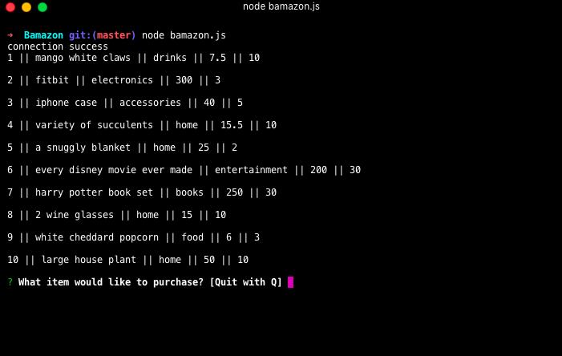
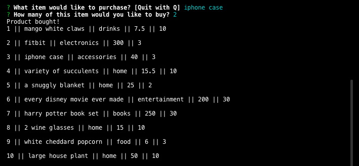
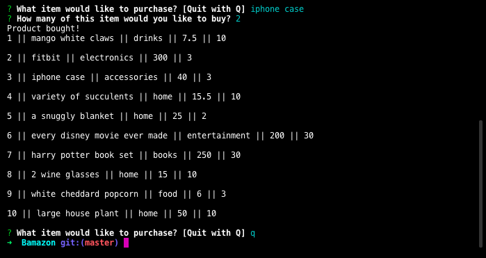

# **Bamazon**

## **About this App:**

    Bamazon is an Amazon like storefront with MySQL and node tricks. MySQL is used to create a database of products for the customer to choose from. Inside the products table is populated with 10 items these columns:
            1. Item_id
            2. Product_name
            3. Department_name
            4. Price
            5. Stock_quantity

## **How to use Bamazon:**

 

###### This first image is showing a successful connection to node as well as the results when the command node bamazon.js is typed. This command populates the MySQL database. As well as asking what item the customer would like to buy and then giving an option to quit the transaction.

 

###### This images shows the prompt that pops us when node bamazon.js command is run which is asking which item the customer would like to buy. Once that Item is chosen node prompts the next question of how many. Once this quantity is entered there is a confirmation statement and the quantity next to the purchased item decreases.

###### Same information as the previous image, this one also includes the prompt after the previous item was purchased. Node is again asking the customer what item they would like and giving an option to quit.

    

### **Step by Step Instructions:**

    1. Open terminal.
    2. Navigate to the folder that contains the bamazonCustomer.js file
    3. Run node bamazonCustomer.js and you will be prompted with two messages
    4. Select the item you would like to buy.
    5. Identify how many of the selected item you would like to purchase.
    6. Continue this or press Q to quit at any time.

### **Summary:**

    MySQL creates a database of products that will be available for purchase once the node command is run. The customer will then be prompted through the options and the results will be output in the terminal.

## **Deployed Version Link:**

    (https://chelsea4crooke.github.io/Bamazon/)

#### **Technologies Used:**

    1. MySQL
    2. Node packages
    3. Javascript
    4. Git
    5. Github

#### **Command Executions:**
    1. Node bamazonCustomer.js
